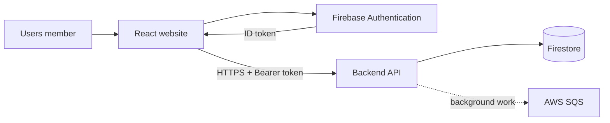
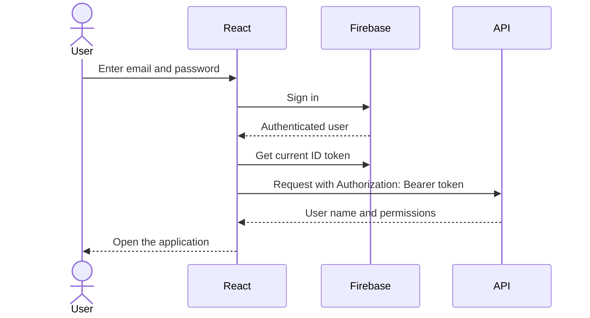

# Frontend guide

## What this application is

This folder contains the website used by PAI Users. It is a React single-page application: the browser loads one application, then React changes the visible page without doing a full page reload. Users can sign in, manage students, record payments, and organize batches and teachers.

The frontend does not access the database directly. Firebase is used only to sign users in. All business data travels through the backend API.

## Big picture



## Main screens

| Browser route | What a person can do | Main component |
|---|---|---|
| `/Login` | Sign in with Firebase | `LoginForm` |
| `/Home/Active` | See and edit active students | `HomePage` |
| `/Home/Deactive` | See deactivated students | `HomePage` |
| `/Home/Unapprove` | Review students awaiting approval | `HomePage` |
| `/Home/Add` | Add a student | `CreateForm` |
| `/Payments/Show` | Search payment history by student/month | `PaymentsPage` |
| `/Payments/Create` | Record payments | `CreatePayments` |
| `/Payments/Total` | See monthly totals | `ShowTotalPaymentsPage` |
| `/Batches/Dashboard` | See batches and teachers | `BatchesPage` |
| `/Batches/:batchSlug/view` | See a batch and its students | `BatchDetailView` |
| `/Batches/:batchSlug/add` | Add unassigned students to a batch | `AddStudentsToBatch` |
| `/Audits/Show` | See global user-side audit history from the last 30 days | `AuditsPage` |

Unknown URLs show `PageNotFound`.

## Sign-in and API flow



`App.js` watches Firebase login state. After login it calls the permissions API and decides which routes to show. `AxiosInterceptor.js` automatically gets a current Firebase ID token and adds it to every Axios request. A `401 Unauthorized` response signs the user out.

## Student flow

1. The home page sends an `x-status` header to load Active, Deactive, or Unapproved students.
2. Creating a student first checks whether their code already exists.
3. An Admin-created student becomes active immediately. A non-admin-created student waits for approval.
4. Admins can approve, activate, deactivate, edit, or delete students.
5. Audit dialogs show who changed a record and when.

## Payment flow

1. The user chooses a month and one or more active students.
2. The UI sends the payment request to the backend.
3. The backend queues the slower creation work and immediately confirms receipt.
4. The QueueWorker writes payment records, totals, indexes, and audit entries.
5. Payment screens read the resulting student history, monthly paid/unpaid lists, and totals.

Payment and batch screens are intended for Admin users; the backend enforces this even if someone manually visits a URL.

## Batch flow

Admins create teachers, create batches with one or more teachers, then add available students. A student can belong to only one batch, and a batch can contain at most 40 students. The batches dashboard can search selected active students and show their current batch assignment. Students can be removed or moved between batches from either the batch detail table or the search results table. Deactivating/deleting a student asks the QueueWorker to remove that student from any batch.

## Audit flow

The Audits navbar item is available to every signed-in user. It opens a Material React Table with Title, User, and Date Time columns. The page reads `/api/audits`, which returns only user-side audit messages from the last 30 days with the newest entry first. The Clear History button calls `/api/audits/clear`; when the backend returns HTTP 200, the UI shows `Clear Started`, retained records are normalized to the three table fields, and the table refreshes.

## Important code locations

| Location | Responsibility |
|---|---|
| `src/App.js` | Login-state handling and route definitions |
| `src/Components/AxiosInterceptor/` | Adds the Firebase token and handles unauthorized responses |
| `src/Components/HomePage/` | Student lists, creation, and editing |
| `src/Components/PaymentsPage/` | Payment entry, history, and totals |
| `src/Components/BatchesPage/` | Batches, teachers, and membership |
| `src/Components/AuditsPage/` | Global user-side audit history |
| `src/Providers/` and `src/Context/` | Shared dialogs, snackbars, and permissions |
| `src/Configs/FirebaseConfig.js` | Firebase browser setup from environment variables |

## Configuration

Create a local `.env` file and keep it out of source control. It needs Firebase browser values (`REACT_APP_API_KEY`, `REACT_APP_AUTH_DOMAIN`, `REACT_APP_PROJECTID`, `REACT_APP_STORAGE_BUCKET`, `REACT_APP_MESSAGING_SENDERID`, and `REACT_APP_APP_ID`), `REACT_APP_BASE_URL`, and the `REACT_APP_*_API_URL` values referenced in `src`.

API URL variables are paths such as `/api/home`; `REACT_APP_BASE_URL` is the deployed backend/function base. Never put Firebase Admin credentials or AWS secret keys in the frontend: every `REACT_APP_` value is included in the browser build.

## Run and build

```bash
npm install
npm start
npm test
npm run build
```

`npm start` runs the development site. `npm run build` creates the production files in `build/`. Netlify settings are in `netlify.toml`.
